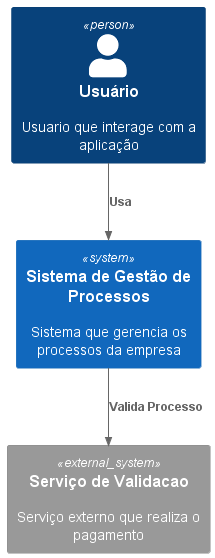
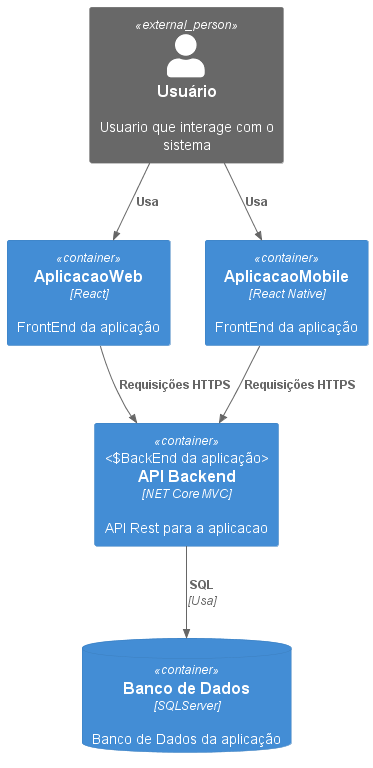
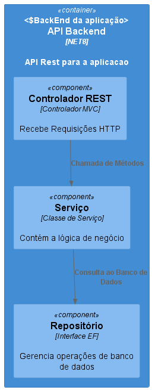
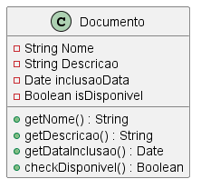
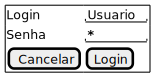
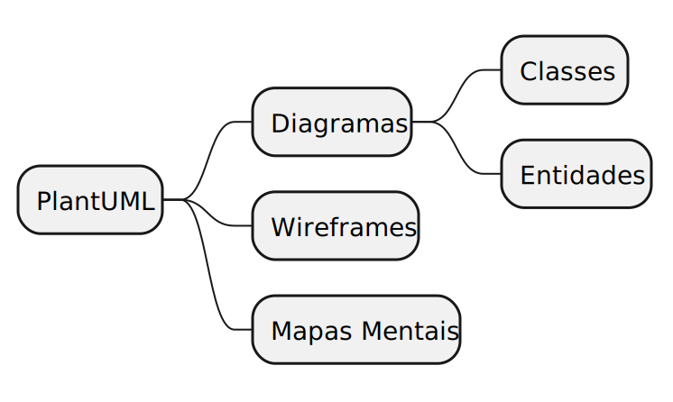
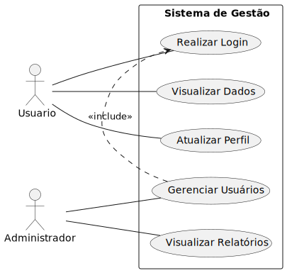
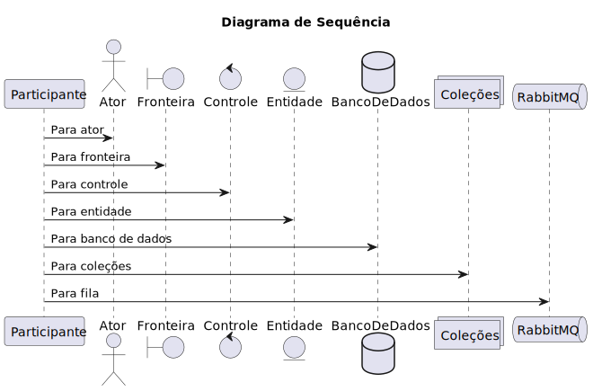

# Modelo C4

O modelo C4 é uma abordagem para a modelagem de arquitetura de software que visa fornecer uma visão clara e concisa da arquitetura de um sistema. Ele é composto por quatro níveis de abstração: Contexto, Contêiner, Componente e Código.

## Requisitos

Para que o PlantUML possa funcionar é necessário instalar o JRE (Java Runtime Environment) e o Graphicviz na máquina para que ele possa renderizar as imagens dos diagramas.

## Nível 1: Contexto

No nível de contexto, descrevemos a visão geral do sistema, identificando os atores externos e os principais sistemas com os quais o sistema em questão interage. Isso nos ajuda a entender o ambiente no qual o sistema está inserido.

## Nível 2: Contêiner

No nível de contêiner, descrevemos os principais contêineres que compõem o sistema, como aplicativos web, serviços, bancos de dados, dentre outros. Também identificamos as interações entre esses contêineres, fornecendo uma visão de alto nível da arquitetura do sistema.

## Nível 3: Componente

No nível de componente, descrevemos os principais componentes dentro de cada contêiner. Isso nos ajuda a entender como os diferentes componentes se relacionam e interagem entre si.

## Nível 4: Código

No nível de código, podemos fornecer detalhes técnicos sobre a implementação dos componentes. Isso pode incluir diagramas de classe, diagramas de sequência, diagramas de atividades, entre outros.

## Exemplo Prático

Para ilustrar a aplicação prática do modelo C4, vamos considerar um sistema de biblioteca. No nível de contexto, identificamos os atores externos, como clientes, fornecedores e sistemas de pagamento. No nível de contêiner, identificamos os principais contêineres, como o aplicativo web, o banco de dados e os serviços de pagamento. No nível de componente, descrevemos os principais componentes dentro de cada contêiner, como o carrinho de compras, o catálogo de produtos e o processador de pagamento. Por fim, no nível de código, podemos fornecer detalhes técnicos sobre a implementação desses componentes, como as classes e métodos utilizados.

O modelo C4 nos ajuda a ter uma visão clara e estruturada da arquitetura do sistema, facilitando a comunicação entre os membros da equipe e permitindo uma melhor compreensão do sistema como um todo.

<!-- ## Wireframe

Também é possível criar wireframes.

## Mapas Mentais

Também é possível criar mapas mentais

## Caso de Uso

Diagrama de Caso de Uso

## Sequência

 -->