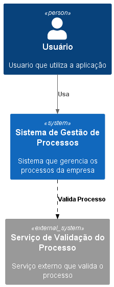

# Modelo C4

O modelo C4 é uma abordagem para a modelagem de arquitetura de software que visa fornecer uma visão clara e concisa da arquitetura de um sistema. Ele é composto por quatro níveis de abstração: Contexto, Contêiner, Componente e Código.

## Requisitos

Para que o PlantUML possa funcionar é necessário instalar o JRE (Java Runtime Environment) e o Graphicviz na máquina para que ele possa renderizar as imagens dos diagramas.

## Principais

[Clique aqui](CPrincipais/README.md)

## Casos de Uso

[Clique aqui](CUseCases/README.md)

## Classes
[Clique aqui](CClass/README.md)

<!-- ## Nível 1: Contexto

No nível de contexto, descrevemos a visão geral do sistema, identificando os atores externos e os principais sistemas com os quais o sistema em questão interage. Isso nos ajuda a entender o ambiente no qual o sistema está inserido.

## Nível 2: Contêiner

No nível de contêiner, descrevemos os principais contêineres que compõem o sistema, como aplicativos web, serviços, bancos de dados, dentre outros. Também identificamos as interações entre esses contêineres, fornecendo uma visão de alto nível da arquitetura do sistema.

## Nível 3: Componente

No nível de componente, descrevemos os principais componentes dentro de cada contêiner. Isso nos ajuda a entender como os diferentes componentes se relacionam e interagem entre si.

## Nível 4: Código

No nível de código, podemos fornecer detalhes técnicos sobre a implementação dos componentes. Isso pode incluir diagramas de classe, diagramas de sequência, diagramas de atividades, entre outros.

 -->

### Templates

Para ver os templates [Clique aqui](Templates/README.md)

